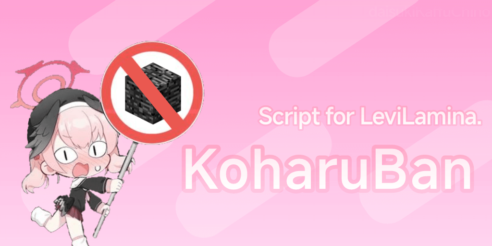

# KoharuBan

## 简介

适用于 LeviLamina 的开源 LLSE 插件。轻松地封禁玩家或禁止玩家持有指定物品，并提供丰富的客制化选项。

这是我编写插件的第一次尝试，还有诸多细节等待完善。如果对你管理服务器有所帮助，欢迎 Star 或宣传它 ><

## 非常遗憾

由于**众所周知**的原因，LL3 将无法更新到 1.21.0 及以上的版本。这使 KoharuBan 后续版本的开发变得没有意义。

在最后的版本中，你可以查阅源代码并通过 `convertToPaper` 方法手动迁移配置到正在开发中的 Paper 端插件 KoharuBan-Java。

你也可以向 Mojang 请愿  [恢复提供 PDB 文件](https://feedback.minecraft.net/hc/en-us/community/posts/27425253557389-Request-to-Continue-Providing-PDB-Files-in-Future-BDS-Versions) ， 让官方听到来自社区的声音。

## 测试于

- LeviLamina *0.12.3*
- LegacyScriptEngine *0.7.12*
- Minecraft BE *1.20.81*
